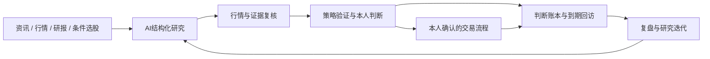

<h1 align="center">RT-ResearchFlow</h1>
<p align="center"><strong>从市场线索到研究、验证、执行与复盘，一个工作台完成。</strong></p>
<p align="center">多来源行情 · AI 研究 · 研报与选股 · 策略验证 · 本人确认交易 · 本地研究记录</p>
<p align="center"><strong>1.3 · 本人确认与持久防重复交易流程</strong> · 持续维护与迭代：<a href="https://github.com/hzqedison">hzqedison</a></p>
<p align="center">
  <a href="https://github.com/hzqedison/RT-ResearchFlow/releases">下载安装</a> ·
  <a href="#核心功能">核心功能</a> ·
  <a href="#从哪里开始">开始使用</a> ·
  <a href="docs/data-sources.md">数据源配置</a> ·
  <a href="docs/trading.md">交易使用说明</a> ·
  <a href="https://github.com/hzqedison/RT-ResearchFlow/issues">问题反馈</a>
</p>

## 不只是看行情，也不只是问一次 AI

RT-ResearchFlow 面向希望把研究、判断和操作连起来的 A 股用户。你可以从一条新闻、一只股票或一个研究问题出发，查看行情与资料，让 AI 整理证据，用策略和历史样本验证想法，再记录自己的判断与后续结果。

市场信息不再散落在看盘软件、聊天窗口、研报网站和笔记里。资讯、行情、AI、策略、交易入口与复盘记录都在同一款应用中，围绕同一只股票和同一条研究线索继续工作。

**产品的重点是让判断有依据，让执行有确认，让结果能回看。**

| 你想做什么 | 在这里怎么完成 |
| --- | --- |
| 不想一开始就购买专业数据服务 | 先用腾讯、东财、新浪等公开来源查询个股日线，按需增加其他来源 |
| 想知道一条消息影响哪些公司 | 资讯分析映射 A 股公司，再结合近期真实行情复核 |
| 想研究一个行业或投资逻辑 | 用产业研究与深度研究组织公司、财报、来源和证据 |
| 想找研报和筛选股票 | 查询研报索引、打开原文，或使用可选 i问财条件查询 |
| 想验证自己的策略 | 配置条件，查看历史命中样本、持有期表现与风险 |
| 想把研究落实到操作 | 进入交易开通与执行流程，在本人确认后处理单笔真实委托 |
| 想知道之前的判断是否靠谱 | 保存判断、安排回访，结合日周复盘和历史版本回看 |

## 核心功能

### 1. 多数据源，不把基础体验绑在一个 Token 上

个股日线支持多选 **Tushare、腾讯财经、东方财富、新浪、通达信、AKShare**，可以调整优先级，按所选顺序尝试可用来源。

- 腾讯、东财、新浪的基础个股日线无需配置 Tushare Token。
- 数据会说明来源、最近事实日期与覆盖范围；来源失败时不编造行情。
- 通达信与 AKShare 为可选本地扩展，不强制所有用户安装。
- 个股新增、刷新、图表及 AI 二轮缺失行情补齐使用统一来源路由。

公开来源适合先体验和轻量研究，但不能替代所有财务、分钟、筹码、全市场及专业策略接口。详细范围见[数据源说明](docs/data-sources.md)。

### 2. 资讯、研报与选股，围绕股票集中查找

资讯情报台支持 RSS/Atom 扫描、分组、去重、归档、全文检索和一键 AI 分析。

研报入口聚合 **东方财富 / AKShare 的研报索引**，展示标题、机构、日期与 PDF 原文链接。**i问财**作为独立的可选条件选股入口，展示查询结果，而不是被包装成券商研报库。

研报索引页不等于 PDF 全文解析或自动摘要；AKShare 的部分接口仍使用东财等公开上游，也不代表额外购买了一份独立数据授权。

### 3. 用自己的模型，把 AI 放进研究流程

可配置 DeepSeek、OpenAI-compatible、Claude、Qwen 等模型服务，使用自己的 API Key 和服务地址。

- **资讯研判**：识别公司、影响方向、产业链传导与持仓风险。
- **行情复核**：结合近期有效日线检查趋势、强弱和价位依据。
- **深度研究**：分阶段计划、取证、综合、审计与写回，区分报告和证据。
- **多视角复核**：围绕同一份证据比较支持逻辑、反证与分歧。
- **持续讨论**：从信号、判断、日报或产业项目继续追问，经本人确认后纳入正式研究。

AI 配置已经支持厂商级保存，修复了未填写其他厂商密钥时的保存问题；空白输入不会随意清除已有加密密钥。模型额度、网络和付费权限仍由本人配置。

研究任务保留阶段、来源、调用与成本记录。可恢复任务不要求从头重复，结果未知的计费请求也不会被自动重放。

### 4. 策略验证与市场观察，不只展示一个“买卖结论”

提供个股走势、长线趋势、大盘云图、竞价与短线观察、策略实验及历史效果评估。

你可以配置股票池、条件、阈值和组合逻辑，查看真实命中样本，并比较信号出现后 T+1 / T+2 / T+3 / T+5 的表现。数据覆盖、样本数量和可信度会与结果一起呈现。

这是研究验证工具，不是收益保证。历史表现不等于未来成交结果，策略信号也不会直接触发真实订单。

### 5. 内置交易流程，由本人掌握最后确认

量化开通、连接检测、表单预览、真实买卖与单笔撤单入口都属于同一款产品，不需要再装一款“交易版”。

当前提供同花顺本机桥接的真实委托代码路径：

- 核实开通要求与客户端权限，先检测连接。
- 填写代码、限价和数量后回读核对，预览本身不提交订单。
- 每笔买卖或撤单经过本人确认与主进程系统确认，默认取消。
- 同花顺自己的确认弹窗仍交给本人处理，不自动点击。
- 等待确认、超时或结果不明时锁住重复请求，不自动重发。
- 可以导出去敏运行结果，用于定位兼容问题，不发送账户资料。

**实际执行桥接目前适用于 Mac 同花顺；Windows 可使用投研和开通引导，但不执行同花顺实盘。当前客户端与中信账户的真实受理、成交及撤单仍需本人验证。**

仅支持当前适配的普通 A 股主板限价路径，不提供自动登录、资金转账、自动调仓或无人值守交易。具体范围、安装权限与操作步骤见[交易说明](docs/trading.md)。

### 6. 研究留在本地，判断能够持续复盘

资讯、行情缓存、观察池、研究项目、判断版本和运行记录保存在本地。今日看板、到期回访、日周复盘和历史对照让一次判断继续形成可验证的研究记录。

API Key、Token 与 i问财 Cookie 由本机加密保存，不作为产品自带凭据，不进入普通日志或去敏导出。使用 AI、数据服务或联网研究时，相应内容仍会发送给本人选择的服务，**本地存储不等于完全离线**。

## 一条完整的工作流



交易不是研究结论的自动出口。证据不足、权限不足、客户端不兼容或结果不明时，界面应保留缺口，让本人继续核实。

## 界面预览

### 资讯与 AI 研判


### 趋势观察


### 策略验证


### 深度研究


预览展示已有工作台，具体选项和新增入口以当前安装版本为准，不把旧截图冒充新增模块截图。

## 从哪里开始

### 下载安装

进入[安装包发布页](https://github.com/hzqedison/RT-ResearchFlow/releases)，在 **Assets** 直接下载安装文件，无需解压源码压缩包：

| 你的设备 | 选择的文件 |
| --- | --- |
| Windows 电脑 | `RT-ResearchFlow-Setup-版本号-x64.exe` |
| Mac Apple 芯片（M 系列） | `RT-ResearchFlow-macOS-版本号-arm64.dmg` |
| Mac Intel 芯片 | `RT-ResearchFlow-macOS-版本号-x64.dmg` |

这些只是同一产品的系统与架构安装包，不是按功能拆分的产品。交易执行的平台限制见上方交易功能说明。

**本分支版本为 1.3（内部版本 1.3.0）。可下载版本以发布页已公开的安装包为准；源码版本号不代表安装包已经发布，实际测试范围与校验值以该版本的发布记录为准。1.3 的 core、native 与 UI 已通过源码与隔离范围的限定验收；Mac 实际编译与安装包须以对应 CI 验收记录为准，不能由这些限定检查推断全产品原生 IPC 或真实账户可用。**

升级时沿用原安装目录并保留数据；Windows 可以安装到 K、D 等非系统盘，Mac 替换应用而不是保留多份副本。当前仍通过完整安装包升级，GitHub 增量更新尚未接入。测试包未配置商业代码签名或 Apple 公证，不应为了安装而全局关闭系统安全保护。

### 第一次使用

1. 先在“配置中心 > 数据源”选择腾讯、东财、新浪等基础来源，保存后查询一只股票。
2. 在研报入口查看目录并打开原文；需要通达信、AKShare 时再安装可选 Python 扩展。
3. 需要 AI 研究时，在“AI 配置”添加自己的模型和 API Key，先保存厂商设置。
4. 建立观察池，尝试资讯研判、趋势观察或一次历史策略验证。
5. 需要交易时，先阅读开通与权限要求，进行连接检测和不提交的表单预览；不要直接把策略信号当成实盘指令。

i问财需本人合法登录 Cookie、Python 扩展与 Node.js 运行环境。数据权限、模型 Key 和券商交易权限互不替代；任何模块都不提供共享账户或共享密钥。

## 1.3 更新摘要

1. **持久防重复与本人确认**：保存不可重复执行的订单意图，确认绑定原请求及持久记录；未知结果逐单核对，重启不自动重发。人工核对不是机器成交证明，也不允许重试原意图。
2. **显式初始化与可信旧域导入**：新交易记录域须本人明确初始化；已可信封存且尚无 SQLite 的旧域可申请准备导入，原生确认后重新校验，再由本人单独确认恢复计划。不自动启用真实会话，不把旧记录伪装成新域。
3. **目录与执行保护**：默认使用专属交易记录目录并检查安全边界；存储异常、执行器退出未证实或停止中保持保护，不以超时或空回报推断未提交。
4. **单笔撤单与回读拒绝**：修复最终撤单仅选中目标委托的路径；回读不一致或协议解释有歧义时拒绝继续，不以盲点或全撤替代。

Windows 与 Mac 仍是同一款投研产品；本机交易执行代码路径仅适用于 Mac 同花顺，Windows 不执行同花顺实盘。源码限定检查不代表真实 THS、Mac 辅助功能（AX）或真实账户已验证，也不提供全自动或无人值守交易。

**升级限制：未被可信封存的 1.2 旧交易日志目前不能自动安全迁入。保留原记录与保护，不通过清空日志或挪动目录伪装修复；这一限制影响交易模块，不等于投研数据损坏。** 具体变化、验收状态与风险见 [1.3 发行说明](docs/releases/v1.3.0.md)。

## 1.2 更新摘要

1. **准确解释数据状态**：区分真实缺口、按需缓存和未选题材源，不把所有空表当故障，也不把未参与检查的项目算作正常。
2. **单日事实补齐**：独立补齐竞价与精确前一交易日涨跌停，显示真实日期和结果，不顺带生成策略信号；失败保留已有数据。
3. **恢复正常竞价入口**：先读取竞价事实，再按分池判断依赖；事实补齐或修订后重建本地快照，不因个别缺口让整页空白。
4. **观察与请求保真**：旧字段不冒充新观察，不把异常分页子集保存为完整数据；采集预算和重复请求冷却使用单调时间约束。

1.2 已发布，数据诊断、初始化、交易日与竞价事实透明相关修复已独立验收。使用入口、来源权限与该版本验收边界见 [1.2 发行说明](docs/releases/v1.2.0.md)。这些修复不承诺免费完整竞价，也不把安装包检查视为真实券商交易验收。

## 1.1 更新摘要

1. **免 Key 官方交易日历**：在已支持的官方年度公告范围内提供日历，逐日检查覆盖；补充日期尊重已有闭市记录，未知前驱保持未知，不跨缺口推断。年度计划不代表临时休市或所有证券均已核实。
2. **数据质量与盘后口径**：核心基准按查询截止日排除未来数据后判断质量，统一盘后日线日期口径；盘后补漏不因缺少 Tushare Token 被整体跳过，实际行情仍取决于所选来源的能力和权限，不承诺免费实时竞价。
3. **配置与运行可靠性**：改善单厂商配置保存和重启保留，启动等待数据库就绪，退出有界等待已登记任务；迁移前生成并验证 SQLite 一致性快照，调度增加运行代次保护。
4. **受信 IPC 与手动反馈**：相关入口校验主窗口调用，错误提示提供问题编号；诊断页支持脱敏预览和手动本地导出，不自动上传。部分旧后台任务仍待迁移。
5. **GitHub 更新下载**：改善完整安装包下载的取消、失败残留处理及中文提示；仍由本人安装，不提供真正差分增量或自动覆盖，也不代表已完成签名公证。

已发布功能与验证边界见 [1.1 发行说明](docs/releases/v1.1.0.md) 和 [1.2 发行说明](docs/releases/v1.2.0.md)。Mac Apple 芯片与 Intel 包是同一产品的两种架构，真实交易仍须本人逐笔确认；平台安装检查不等于实盘验收。

完整规则见[版本与发布约定](docs/versioning.md)。既有 beta 发布保留，不重命名旧安装包冒充新构建。

## 使用边界

- 不构成投资建议，不承诺收益；行情可能延迟、缺失，AI 可能出错，判断由本人核实。
- 开源库和公开接口不代表无限免费使用或拥有网站数据授权，应遵守来源条款。
- 通达信和 i问财适配依赖的部分开源发行较旧，明确标注实验，不承诺所有上游一直可用。
- 研报索引不是全文，委托受理不是成交，开通登记也不是实盘授权。
- 不读取浏览器登录凭据，不绕过验证码、付费权限或券商限制，不替用户登录或确认订单。
- 同花顺交易连接不能替代完整投研数据，安装检查也不能代替真实客户端兼容验证。

<details>
<summary>开发与自行编译</summary>

完整产品源码位于[当前开发分支](https://github.com/hzqedison/RT-ResearchFlow/tree/codex/release-1.3)。默认首页用于产品介绍，开发时使用该分支，不把其他历史分支当成最新构建源码。

```sh
git clone --branch codex/macos-support https://github.com/hzqedison/RT-ResearchFlow.git
cd RT-ResearchFlow
corepack enable
corepack prepare pnpm@10.14.0 --activate
pnpm install --frozen-lockfile
pnpm run dev
```

源码需要 Node.js 20、pnpm 10.14.0。生产构建使用 Electron ABI 对应的 SQLite 原生模块，不能跨系统复用 `node_modules`。运行安装包无需先安装 Node.js 或数据库，可选数据扩展另行配置。

Windows 构建：`pnpm run dist:win`。Mac 构建在对应架构上执行 `node macos/build.mjs`。详细说明见[macOS 编译文档](macos/README.md)。

类型、源码、隔离测试与生产构建的统一入口为 `pnpm run verify`。不得在测试、提交或发布中加入用户 Key、Cookie、账号、数据库和原始日志。

</details>

<details>
<summary>开源许可与致谢</summary>

本项目继续遵循 **AGPL-3.0-only**，完整条款见 [LICENSE](LICENSE)。持续迭代由 **hzqedison** 维护，当前新增与改进包括交易流程集成、多来源数据、配置体验和统一产品发布说明。

基础代码、既有工作台和第三方组件的版权与许可证分别保留，具体来源见 [NOTICE.md](NOTICE.md)。产品展示不重复堆叠来源链接，但不删除必要署名、不声称所有基础代码均为重新原创，也不因此取得其他权利人的商业再许可权。

欢迎通过 [Issues](https://github.com/hzqedison/RT-ResearchFlow/issues) 反馈问题，只分享去敏结果，不公开账户资料或密钥。

</details>
