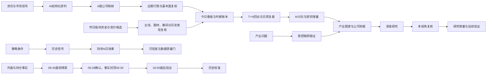

<h1 align="center">RT-ResearchFlow</h1>

> 本轮版本：**0.1.0-beta.9**。新增多选日线、东财/AKShare研报索引、i问财实验查询与可选本地 Python 扩展。Windows、Mac Apple 芯片和 Intel 使用同一版本，安装包及检查记录见 [beta.9 发布页](https://github.com/hzqedison/RT-ResearchFlow/releases/tag/v0.1.0-beta.9)；发布页尚无附件时不视为已经发布。
>
> 本版多选不是所有专业数据的完全替代；研报提供索引和原文入口，不冒充PDF全文。详细接入、依赖和授权边界见 [多源接入说明](https://github.com/hzqedison/RT-ResearchFlow/blob/codex/macos-support/docs/data-sources.md)。


<p align="center"><b>本地优先的 A 股投研工作台：资讯、AI 研究、策略验证与内置量化交易模块</b></p>

<p align="center">
  
  
  
  
  
</p>

<p align="center">
  <a href="#mac-测试版与下载">Mac 测试版下载</a> ·
  <a href="#mac-量化交易模块">交易实验</a> ·
  <a href="#产品预览">产品预览</a> ·
  <a href="#它解决什么问题">它解决什么问题</a> ·
  <a href="#决策与复盘如何形成闭环">决策闭环</a> ·
  <a href="#盘前情景如何工作">盘前推演</a> ·
  <a href="#短线策略如何工作">短线策略</a> ·
  <a href="#ai-研究如何工作">AI 研究</a> ·
  <a href="#快速开始">快速开始</a> ·
  <a href="#数据隐私与安全边界">安全边界</a>
</p>

> 本地优先，不替用户跳过研究过程，也不把一段 AI 文本直接当成结论。

RT-ResearchFlow 面向希望长期建立自己研究体系的 A 股个人投资者。它不只是展示行情，也不把一段 AI 文本直接当成结论：系统会从资讯中识别相关公司，用近期真实行情进行第二轮复核，将产业研究落实到公司、财报和证据，再把判断、回访和历史效果沉淀到本地。

你可以使用自己的 AI Provider 和数据凭据。基础行情、本地趋势和部分公开资料不依赖 AI；深度研究可以从独立工作台直接发起，多视角复核等能力只在用户显式确认后运行，并记录阶段、证据、Token、成本和恢复状态。

| 用户关心的问题 | RT-ResearchFlow 的回答 |
|---|---|
| 一条消息究竟影响哪些 A 股公司？ | 映射具体公司，识别持仓风险，再用近期真实行情完成第二轮复核 |
| 今天形成的判断以后还能验证吗？ | 判断按版本保存，支持到期回访、日周复盘和事后结果对照 |
| AI 结论依据什么，失败后是否要重来？ | 绑定来源、正文、资料截点和审计账本，长任务可恢复且不会静默重复消费 |
| 一次有价值的讨论如何沉淀下来？ | 从信号、判断、复盘或产业项目继续讨论，整理为语义变更后再正式纳入研究 |

> 本项目用于信息整理、研究记录、历史验证及本人确认的实盘交易接入，不构成投资建议，不承诺收益。不提供策略自动触发、自动调仓或无人值守交易。

## Mac 测试版与下载

本版本在 [原作者 RT-ResearchFlow](https://github.com/caoritian002-wq/RT-ResearchFlow) 的基础上二次迭代，保留投研功能、作者署名与开源许可，并内置 Mac 量化交易模块、开通引导和同花顺本机桥接。资讯、研究、策略与交易模块属于同一个产品、同一个安装包，不需要安装两个版本。新增模块不代表原作者提供的交易服务，也不是中信证券或同花顺官方接口。

当前版本：**v0.1.0-beta.9**。在同一安装包内保留本人确认的中信实盘买卖与单笔撤单路径，新增多选行情与研报数据源，统一应用版本、安装包文件名与发布编号。实盘代码已提供，但尚未在测试者当前同花顺版本及中信账户上验证实际委托受理、成交或撤单。

[查看可下载的 Mac 安装包与各版实际功能](https://github.com/hzqedison/RT-ResearchFlow/releases)：Apple M 系列选择 `arm64.dmg`，Intel 选择 `x64.dmg`。旧版本保留，不覆盖旧安装包。

Mac 安装包为个人测试构建，使用临时签名，未进行 Apple Developer ID 签名或公证；被系统拦截时仅对确认来源的单个应用授权，不关闭系统整体安全检查。详细构建与安装说明见 [Mac 文档](macos/README.md)。

**兼容性状态**：两种架构的构建与隔离检查以发布页记录为准；构建环境没有真实账户，不能证明你的客户端能够下单。请先检查权限和表单回读，确认客户端及账户后才决定是否发起真实委托，只反馈去敏结果。

## 产品预览

### 每日工作台

今日看板把持仓风险、市场线索、策略信号和待处理事项集中到同一个入口，帮助用户先回答“今天最应该关注什么”。


### 决策、回访与复盘闭环

今日信号会按股票和风险优先级进入待办；用户研判时保存结论标签、证据快照、缺口和下一次回访日期。到期后可以维持、修正或结束观察，系统继续保留判断版本，并把日报、周报、历史版本和事后结果放回同一条复盘链。

<!-- SCREENSHOT_SLOT_DECISION_REVIEW_LOOP
文件：docs/screenshots/decision-review-loop.png
建议画面：优先展示按股研判或到期回访面板，同时能看到判断标签、证据缺口、3/7/14日回访和历史版本入口。请使用 RT-ResearchFlow 公开构建与演示数据。
替换下一行占位文案为：
-->

> 截图预留：按股研判、到期回访与不可变判断版本。


<details>
<summary>查看已保存的日报、周报与历史版本</summary>


</details>

### 盘前情景与盘后验证

盘前推演把 08:45 外盘风险、持仓趋势与筹码、行业题材、资讯和 09:28 后取得的真实集合竞价组织成可验证情景，所有事实严格封顶 09:30。确认版按 R1/R2/R3 不可变修订保存；缺失时可以显式重新补采历史竞价、盘前资讯和外盘事实，但不会把 09:30 后的新事实倒灌进盘前判断。


### 从资讯到 A 股研判

资讯进入系统后可以一键进行 AI 分析，输出相关 A 股公司、利好与利空方向、持仓风险，再读取近期日 K、均线、支撑与压力完成第二轮复核。


<details>
<summary>查看 AI 分析进度与完整结果</summary>


</details>

### 产业研究工作台

从研究问题出发，系统分阶段完成联网取证、产业图谱、A 股公司映射、业务暴露、财务时间轴、市场验证和研究报告；长任务可以在后台运行，失败阶段可以继续收集并恢复。


<details>
<summary>查看产业图谱、公司财报与研究证据</summary>


</details>

### 深度研究与多视角复核

`AI分析 → 深度研究` 提供独立的研究工作台：直接选择股票或产业项目，查看全部、进行中和已结束运行，并跟踪计划、取证、综合、审计和写回五个阶段。报告与证据分开呈现；运行结束后，可以让多方、空方和中立主持基于同一份不可变证据进行多轮复核。


<details>
<summary>查看证据页与多视角复核详情</summary>


</details>

### 个股走势与筹码结构

公共股票抽屉统一承载近期日 K、MA5/10/20/60、筹码峰、两日筹码变化、支撑压力、趋势事实和基本面入口，便于从不同工作台快速复核同一只股票。


<details>
<summary>查看筹码变化与更多结构事实</summary>


</details>

### 长线趋势工作台

长线趋势把持仓和观察池放在统一视角下，通过趋势总览、强弱雷达、趋势事件、行业分类和沪深300同期对比，帮助用户识别持续转强、结构走弱以及需要进一步复核的标的；本地趋势摘要会同时说明数据覆盖和判断依据。


### 大盘云图与市场共振

大盘云图把主要指数、行业强弱、板块资金流向和次日竞价观察放在同一市场视角中，帮助用户判断资金是否形成集中方向、哪些板块正在与指数共振，以及当天资金结构能否为下一交易日的早盘竞价提供参考。


<details>
<summary>查看板块资金走势，为第二天早盘提供研判依据</summary>


</details>

### 早盘竞价与短线决策工作台

早盘集合竞价不只列出涨幅榜。系统从候选股反向聚合当日竞价主线，用昨日板块资金与今日竞价进行双重确认，并在个股侧解释“今天在炒什么”，同时结合筹码结论、分时承接和历史表现复核。尾盘、涨停、连板、首阴和低吸工作台统一展示证据、风险、继续确认和明确失效条件。

<!-- SCREENSHOT_SLOT_MORNING_AUCTION_WORKBENCH
文件：docs/screenshots/morning-auction-workbench.png
建议画面：早盘集合竞价战情台，同时展示今日竞价主线、候选队列和选中股票的题材归因，最好能看到“昨日资金 × 今日竞价”、筹码结论与历史表现入口。请使用 RT-ResearchFlow 公开构建与演示数据。
替换下一行占位文案为：
-->

> 竞价主线、题材归因、昨日资金交叉验证与个股研判。


<details>
<summary>查看早盘集合竞价历史效果评估</summary>


</details>


### 策略实验与效果评估

策略实验室允许自由配置股票池、条件、阈值和组合逻辑，再从真实命中样本生成统一回测。效果评估不要求用户维护模拟持仓，而是直接比较不同策略在信号出现后持有 T+1/T+2/T+3/T+5 的表现。


<details>
<summary>查看规则配置与效果评估</summary>


</details>

### 数据质量、回测可信度与 AI 评测

关键数据质量中心检查股票基础、交易日历、日线与复权、竞价、核心基准和产业财务；回测可信度把数据完整性、时间完整性、成交可执行性、样本充分性和稳健性放在收益之前；AI 固定评测集则用版本化合成样本比较不同 Provider 与模型，不让一次看起来合理的回答代替长期质量验证。

> 关键数据质量、回测可信度和 AI 固定评测集。


### 从一次讨论沉淀为研究增量

信号、判断、日报、周报和产业项目都可以进入同一套 AI 研究讨论。讨论保留受限来源上下文和返回位置；只有用户点击“整理本次讨论”后，系统才生成 3 至 7 个可编辑的语义变更包，确认接受后再增量写入产业研究并生成不可变版本。

> 来源上下文、持续讨论、语义变更包与正式纳入。


<details>
<summary>查看产业图谱、公司财报与研究证据</summary>


</details>


## 它解决什么问题

很多个人投研工具停留在“看数据”或“问一次 AI”。RT-ResearchFlow 希望把研究变成一条连续工作流：



系统不替用户跳过研究过程。它负责把来源、事实日期、行情覆盖、反证、未知项和后续验证放在结论旁边，让用户知道结论依据什么、缺少什么、之后如何复盘。

## 核心能力

| 工作台 | 它回答的问题 | 主要能力 |
|---|---|---|
| **今日看板** | 今天先处理什么，之后如何验证？ | 持仓风险、市场机会、策略信号、盘前推演、判断账本、3/7/14 日回访、不可变日报/周报和事后结果对照 |
| **股票走势图** | 这只股票近期结构怎样？ | 日 K、分时、MA/BOLL、AI预测记录、筹码峰、基本面、公告与公共股票抽屉 |
| **长线趋势** | 持仓和观察池中谁在转强或走弱？ | 持仓总览、趋势雷达、趋势事件、观察池、沪深300同期对比和本地趋势摘要 |
| **大盘云图** | 指数、行业和资金是否形成共振？ | 行业云图、市场共振、板块资金流向和次日竞价观察 |
| **短线策略** | 当前有哪些可复核的短线线索？ | 竞价主线、昨日资金交叉验证、个股题材归因、尾盘、涨停、连板、首阴、低吸、筹码与历史表现 |
| **策略实验室** | 自己配置的条件能筛出什么？ | 参数化条件、阈值、组合逻辑、本地扫描、命中证据和运行保存 |
| **策略评估** | 信号出现后持有 N 天表现如何？ | T+1/T+2/T+3/T+5、策略横向比较、样本明细、历史报告和可信度门 |
| **资讯情报台** | 今天有哪些消息值得看？ | RSS/Atom扫描、来源分组、影响评级、去重、归档、全文检索和一键AI分析 |
| **AI研判记录** | 一条消息影响哪些 A 股公司，能否继续形成研究？ | 公司代码映射、利好/利空、持仓警报、真实行情第二轮复核，以及从信号、判断和复盘进入持续讨论 |
| **深度研究** | 一个复杂问题能否形成可审计结论？ | 直接预检与启动、五阶段进度、受控联网、PDF正文、报告/证据分层、恢复与重新研究、多视角复核 |
| **产业研究** | 一条产业逻辑如何持续落到公司和财报？ | 受控搜索、引用、产业图谱、公司映射、业务暴露、财务时间轴、估值情景，以及讨论生成的语义变更包 |
| **可靠性工具** | 数据和模型结果能不能相信？ | 数据质量中心、回测可信度、AI固定评测集、来源状态、失败诊断和恢复动作 |
| **Mac 量化交易模块** | 研究之外，如何本人确认后执行真实委托？ | 同一产品内的开通引导、权限及中信标记检查、表单回读、逐笔系统确认的实盘买卖、单笔撤单、委托/成交页核对和去敏运行结果导出；不支持无人值守 |

## Mac 量化交易模块

量化交易与资讯、AI、策略和复盘属于同一款产品，不单独拆成另一款软件。本版通过 macOS 自带 AppleScript 操作本人已登录的同花顺中信真实账户，不使用 Windows 后台，不保存或代填交易密码，也不是券商官方下单 API。

| 能力 | 当前实现与边界 |
|---|---|
| 开通与权限引导 | 提供券商服务核实清单及本机辅助功能/自动化权限引导；不能代办开户、开通或证明券商已允许相应接入 |
| 连接检查与表单预览 | 检查 A 股模式、中信标记及表单，填写代码、限价、数量并回读；无法可靠识别则停止 |
| 真实买入与卖出 | 明确启用本次会话后，经应用核对及主进程系统确认，尝试提交当前中信账户的单笔限价委托；默认取消，不自动重试 |
| 同花顺原生弹窗 | 保留给本人核对账户、代码、价格与数量，并本人确认或取消；不自动点击 |
| 委托受理与成交 | 无原生弹窗且检测到唯一新增、参数匹配的委托编号时才标记受理；受理不等于成交。委托、成交在同花顺本机查看，不等于已实现结构化账户同步 |
| 单笔真实撤单 | 本人系统确认后，按精确委托编号选择单行并尝试单笔撤单，不使用全撤；已成交部分无法撤销，回报不明须本人核对 |
| 无人值守与策略自动执行 | 不支持，AI 判断与策略信号不会自动触发真实订单 |

使用顺序：

1. 本人核实中信账户及相关软件接入要求，手动登录同花顺，并选择正确的中信真实账户；不向他人提供登录资料。
2. 在同一应用的“量化开通 > 真实交易”中申请必要的辅助功能及自动化权限，检查连接。
3. 自行填写普通主板代码、限价、数量及委托金额上限，先做“填写表单并回读（不提交）”。
4. 明确确认风险并启用本次会话；重启应用后默认关闭。开通引导的登记标记不授予实盘交易权限。
5. 发起买卖或单笔撤单时，本人核对应用确认及系统确认框。系统默认取消；操作过程中不要切换账户、窗口或同时手动下单。
6. 同花顺若出现自己的弹窗，到同花顺本人核对并确认或取消。出现等待确认、超时或回报不明时，本应用锁住重复请求；先核对委托与成交，再解除保护，不自动重发。
7. 只反馈去敏运行结果，不发送账号、持仓、资金、订单编号、密码、Key、确认凭据或原始日志。

本版的真实交易路径已实现，但未在测试者当前 Mac 同花顺与中信账户上证明可用。客户端布局、选中状态、券商标记、表头或回报不兼容时会停止，不能将开源参考脚本或隔离检查当作实盘兼容性保证。

当前仅支持普通 A 股主板限价，不支持科创板、创业板、ETF、转债、自动登录、资金转账、自动调仓或无人值守。

交易模块不提供完整历史行情、财务、资讯或模型服务。beta.9 已接入腾讯财经、东方财富、新浪与可选通达信、AKShare 个股日线，以及研报索引和 i问财条件查询；不等于全部专业数据免费替代。Tushare 与 AI 等配置继续按需使用，BaoStock 尚未集成。

## 决策与复盘如何形成闭环

入口位于 `决策中心 → 今日看板`。这里不是只展示当天信号，而是把一次判断从“待处理”带到“可回看、可修正、可验证”：

1. **聚合待办**：资讯、持仓风险和策略信号按股票聚合，用户先处理风险更高、证据更完整或更接近回访日期的事项。
2. **保存判断**：记录结论标签、证据快照、反证、未知项和下一次回访日期，避免日后用新信息改写当时为什么这样判断。
3. **按期回访**：在 3/7/14 日等回访节点选择维持、修正或结束观察；每次变化形成新版本，旧判断继续保留。
4. **形成复盘**：日报和周报汇总当期信号、判断变化与未处理事项，并以不可变版本保存，休市日也能回看最近交易日内容。
5. **对照结果**：本地行情成熟后，系统把判断与真实走势放在一起核对；缺少行情或样本时明确显示缺口，不把缺失包装成命中。
6. **继续研究**：从信号、判断、日报或周报进入 AI 讨论，保留原始上下文；有价值的讨论可以整理为语义变更，再由用户确认是否纳入产业研究。

## 盘前情景如何工作

盘前推演位于“决策中心 → 今日看板”标题区。它不是直接预测涨跌，而是把下一交易日可能面对的路径拆成可验证的情景：

1. **07:30 与 08:45 外部事实**：盘前联网采集默认关闭；开启后，系统在可信时间窗口内记录全球主要指数、汇率、利率、商品等外生风险，不把外盘上涨直接等同于 A 股或个股上涨。
2. **08:45 初版情景**：将外部风险与当前持仓的趋势、筹码、公告、资讯、行业和题材事实组合，输出基准、强化、风险三种情景及各自的支持、反证、确认、失效和未知项。
3. **09:28 竞价确认，09:30 事实封顶**：09:28 只是确认版生成门槛，09:30 是事实边界。系统使用真实集合竞价确认或削弱初版，不在 09:27 提前生成。
4. **09:29 组合提醒**：存在合格确认版时只发送一条组合通知，点击后回到同一个盘前版本。
5. **18:00 盘后验证**：读取当日完整 OHLC，标记高开承接、高开回落、低开修复、全天偏弱等实际路径，并累计历史覆盖与分组样本。

所有正式版本按交易日、阶段和修订不可变保存。确认版从 R1 开始，用户显式“重新补采”后最多形成 R2/R3；晚采的 09:25 竞价和 09:30 前精确发布的资讯、公告可以进入新修订，09:30 后的新事实仍被排除。缺失的 08:45 外盘事实优先通过 Tushare 最近已闭市美股日线和东方财富日韩历史分钟恢复，且每条事实必须不晚于原截点。休市日会明确展示最近交易日版本；盘后验证和可选 AI 解释绑定当前修订，下一交易日准备不会替换历史结论。

## 短线策略如何工作

入口位于 `短线策略 → 早盘集合竞价`，尾盘、涨停板、连板龙头、首阴和低吸则提供不同交易阶段的补充观察。它们共享一条“先找方向，再复核个股，最后验证历史表现”的逻辑：

1. **从候选反推主线**：不只按涨幅罗列股票，而是把竞价候选按行业和题材聚合，识别当日是否存在集中方向。
2. **用前后两日事实确认**：将昨日板块资金与今日集合竞价交叉对照，区分资金延续、竞价新方向和仅有少量个股异动的噪声。
3. **解释个股在炒什么**：在候选股票侧展示主炒题材、相关题材和归因依据，并结合筹码结论、分时承接、趋势与近期行情继续复核。
4. **统一表达风险边界**：尾盘、涨停、连板、首阴和低吸不只给名单，同时展示支持事实、风险、继续确认条件和明确失效条件。
5. **回到真实样本**：信号进入策略效果评估，统一查看 T+1/T+2/T+3/T+5 表现、样本明细和可信度门；数据不足时不输出看似精确的胜率。

## AI 研究如何工作

### 普通资讯分析

普通分析优先解决“这条消息与哪些 A 股公司有关”。第一轮提取公司代码、产业链传导、利好与利空及持仓风险；第二轮读取本地或接口中的近期真实行情，再分析趋势、相对强弱、支撑和压力。没有有效公司代码或行情不足时，界面会明确提示缺口，而不是伪造第二轮结论。

### 持续讨论与研究增量

资讯分析、策略信号、判断记录、日报、周报和产业项目都可以进入研究讨论。系统保留来源类型、原始上下文和返回位置，因此追问不会变成一段与业务脱节的孤立聊天。

讨论本身不会自动改写正式产业研究。只有用户显式选择“整理本次讨论”后，系统才会提取 3 至 7 个可编辑的语义变更包；用户确认接受的内容会增量写入产业项目并形成新的不可变版本，未接受内容不会混入正式研究结论。

### 全局深度研究工作台

用户不需要先理解或创建“研究讨论”，可以直接从 `AI分析 → 深度研究` 开始：

1. 选择股票或已有产业研究项目，输入研究问题，并确认是否允许使用持仓这一敏感范围。
2. 系统先执行零写入预检，展示固定 Provider、模型、资料截点、主体和证据策略；配置缺失时可以直接前往 AI 配置。
3. 启动后在同一工作台查看全部、进行中和已结束运行；切换到其他页面不会取消主进程任务。
4. 五阶段进度带持续展示当前步骤、模型与工具累计次数、连续耗时，以及计划、工具、门禁、综合、审计和写回消息。
5. 完成态分别展示“执行状态”和“结论覆盖”。运行成功只代表流程和账本完整，结论仍可能是完整、受限或受阻。
6. “研究报告”优先展示结论，“证据”页集中展示来源、正文、门禁、调用、成本和审计；可以返回内部讨论继续追问。

### 可恢复的深度研究

深度研究运行在 Electron 主进程，并把计划、工具调用、模型调用、证据、Token、成本和报告写入本地四级账本。应用中断后不会自动继续消费额度，只有显式继续才会从最后成功阶段恢复。

证据流程遵循以下顺序：

1. 固定研究问题、主体、资料截点、Provider、模型、规则和工具版本。
2. 读取本地行情、趋势、基本面、公告、资讯或产业项目快照。
3. 执行证据充分性检查；只有硬缺口存在时才开放受控联网工具。
4. 搜索结果只作为候选；网页或 PDF 取得可引用正文后才计入证据，转载、过期、无关或伪官方来源不会凑数。
5. 每批补证后重新检查。当前事件至少要求两份独立正文且包含一级来源；产业研究至少要求三份独立正文、两份近三年资料和一份一级来源。
6. 门禁通过后使用实际采用的最小合格正文进行综合；证据仍不足时只形成受限或受阻结果，不用模型常识补齐。
7. 报告经过确定性审计后写回内部讨论，可继续追问或整理为产业研究增量。

暂停或可恢复失败会继续原账本；结果未知、取消或不可恢复失败需要“重新研究”，以当前资料截点创建可对照的新账本。删除只作用于当前选中的终态记录，不会连带删除其他重试；存在直接多视角复核依赖时会阻止删除来源记录。

### 绑定证据的多视角复核

多视角复核不是让多个模型自由发挥。它只接受已经完成且证据充分的深度研究，固定复用父运行的不可变证据：

```text
同一证据快照
    ├─ 多方：成立逻辑、支撑事实、前提和未知项
    ├─ 空方：反证、风险事实、脆弱环节和未知项
    └─ 中立主持：共识、核心分歧、剩余未知、验证清单
```

多视角复核不再取数、不再联网，也不调用工具。多方与空方至少完成两轮交锋，并根据实质分歧继续收敛，最后由中立主持汇总；事实主张必须引用父运行中的稳定证据编号。最终结果不输出买卖、仓位、目标价或收益承诺。

### 调用与成本边界

| 类型 | 模型策略 | 工具策略 | 联网 | 说明 |
|---|---|---|---|---|
| 新建或重新研究 | 按研究需要收敛，不设固定次数 | 按研究需要，每轮最多2个 | 仅按证据缺口开放 | 固定模型与主体，保留输入、结果容量和安全网络边界 |
| 多视角复核 | 至少两轮多空交锋，按分歧收敛 | 0 次 | 不联网 | 只复用父运行不可变证据 |
| 历史研究账本 | 保持创建时固化的旧预算 | 保持创建时固化的旧预算 | 按历史规则 | 不升级、不改写、不静默重放 |

“不设固定次数”不代表无边界运行：主体权限、证据门禁、每轮工具数、输入与工具结果容量、SSRF、重定向、MIME、响应体积、显式取消、幂等和单活动运行保护仍然生效。实际费用取决于用户配置的 Provider、模型价格和上游计费规则；请求提交后响应未知时，同一运行禁止自动重放，界面会提示可能的重复费用风险。

## 数据源

RT-ResearchFlow 使用“本地事实优先、用户显式补齐、失败保留旧事实”的数据策略。

- **本地 SQLite**：保存资讯、行情缓存、持仓、观察池、策略信号、研究项目、AI会话、判断账本和运行审计。
- **Tushare**：可选，用于更完整的 A 股基础数据、日线、财务、题材、筹码和部分策略数据，也可在显式盘前补采时读取最近已闭市的美股日线；具体能力取决于账号权限。
- **东方财富与新浪财经等公开接口**：用于单股零 Key 日线、公司概况、主要财务、公告索引及部分市场数据的显式补齐或降级；盘前补采可读取日韩 08:45 历史分钟，并在 Tushare 不可用时回退美股历史日线。
- **全球市场公开行情**：用于用户启用后的盘前外生风险快照、受控历史恢复和下一交易日准备；每条恢复事实受原截点约束，只提供 A 股情景证据，不扩展为海外交易工具。
- **RSS/Atom 与公开网页**：用于资讯扫描；来源、发布时间和采集时间分别记录。
- **用户自己的 AI Provider**：支持 Claude、ChatGPT/OpenAI-compatible、Qwen、DeepSeek 等配置。
- **受控网页搜索与正式披露入口**：只在深度研究证据不足且用户已配置相应服务时使用。
- **受控 PDF 正文**：交易所、公告和研报 PDF 经主进程安全出口与正文解析器处理，解析失败保留哈希和缺口诊断，不把文件标题当作正文证据。

不同网络环境、接口权限、交易日历和上游服务状态会影响数据覆盖。界面会尽量展示来源、事实日期、覆盖、失败原因和恢复入口，但不会把缺失值填成确定事实。

## 数据隐私与安全边界

- 数据以本地 SQLite 为权威源；Windows 安装版的数据库、配置、备份、缓存和日志保存在用户选择安装目录下的 `data` 子目录。Mac 使用本机数据目录，具体位置以设置或诊断页显示为准；替换应用前建议备份，不把应用包当作用户数据备份。
- Tushare Token、AI API Key 和搜索服务凭据由主进程加密管理，不进入 renderer、研究账本、模型投影或普通日志。
- Electron 保持 `sandbox` 与 `contextIsolation`，禁用 `nodeIntegration` 和远程 `webview`；非应用导航、窗口和权限默认拒绝。
- Agent 联网通过独立安全出口，阻断私网、环回、危险重定向、凭据传播、超大响应和不受支持的内容类型。
- 深度研究的搜索只登记候选，正文工具只接受同一运行已经落账的候选 ID；renderer 和模型都不能提交任意 URL 抓取。
- 模型或联网请求提交后失联会进入结果未知状态，同一账本禁止自动重放；旧账本、证据和可能费用提示均保留。
- 本机 MCP 默认关闭，只能读取用户明确授权的事实范围；不开放 SQL、文件、Shell、任意网络、数据刷新或交易动作。
- 页面加载、打开抽屉和应用重启不会因为“顺便补齐”而自动遍历持仓、调用 AI 或消费 Token。
- Mac 真实交易默认关闭，只能本人显式启用当前会话；每笔实盘操作必须经过主进程系统确认。同花顺弹窗留给本人处理，无人值守与自动重试关闭。去敏导出不含账户资料、订单参数、确认凭据或原始日志，不自动上传。
- 盘前联网采集默认关闭；休市回看只读本地冻结版本，重新补采和下一交易日准备仅在用户显式点击后请求网络，且不能把截点后的事实倒灌进历史版本。

## 架构

```text
RT-ResearchFlow/
├─ src/                         React 18 + Zustand + Tailwind renderer
├─ electron/
│  ├─ preload/                  窄类型 IPC 边界
│  └─ main/                     任务、数据、AI、研究与安全网络出口
├─ tests/                       Vitest + Playwright
├─ resources/                   安装与内置资源
├─ scripts/                     构建、体积与启动测量
└─ package.json
```

运行边界：

```text
React Renderer
      │  仅允许白名单 window.api
      ▼
Sandbox Preload
      │  窄 IPC
      ▼
Electron Main Process
      ├─ SQLite / FTS5
      ├─ 行情、资讯、财务与策略服务
      ├─ AI与可恢复研究运行器
      ├─ 受控联网出口
      └─ 当前用户本机 MCP 网关
```

## 快速开始

### 环境要求

- Node.js 20.x LTS
- pnpm 10.x，仓库锁定 `pnpm@10.14.0`
- Windows 10/11 x64 用于当前主要开发和安装包验证
- Mac 测试构建要求 macOS 12 或以上，分别提供 Apple 芯片与 Intel 安装包；同花顺交易实验额外需要本人已安装并登录的 Mac 客户端及所需系统权限

### 从源码运行

```bash
corepack enable
corepack prepare pnpm@10.14.0 --activate
pnpm install --frozen-lockfile
pnpm run dev
```

首次启动不要求配置 AI 或 Tushare。用户可以先通过公开数据源查询单股日线、建立观察池并体验本地趋势；需要更完整数据、AI分析或联网研究时，再在配置中心按需添加凭据。

### 构建 Windows 安装包

```bash
pnpm run dist:win
```

安装器支持选择安装目录。普通升级和卸载默认保留安装目录下的 `data`，正式迁移或删除前仍建议从诊断页执行备份。

### 构建 Mac 测试安装包

在相应架构的 Mac 上执行：

```bash
node macos/build.mjs
```

Mac 安装包构建使用独立配置并按目标 Electron ABI 重建本机依赖，不能复用 Windows 的数据库原生模块。应用版本来自 `package.json`，不会随每次提交自动增加；发布新的测试版时递增 `beta.N`，并同步发布编号与文件名，避免同名覆盖。更详细的说明见 [Mac 文档](macos/README.md)。

## 配置 AI

在客户端配置中心选择 Provider、模型、Base URL 和凭据。普通 AI 研判与深度研究共用受控配置，但深度研究会在创建时固定 Provider、模型、资料截点和规则版本，不会在运行中静默切换备用模型。

本机 Agent 用户可以在“设置 → 本机研究访问”中创建访问配置，选择 `market.read`、`research.read`、`portfolio.read` 等权限并复制一次性 MCP 配置。访问配置可以停用、轮换或撤销，最近调用保留有界审计。

## 测试与质量门禁

```bash
pnpm run typecheck
pnpm run lint
pnpm run test:unit
pnpm run build
pnpm run verify
```

`pnpm run verify` 是统一质量门禁，依次执行 Node/Web TypeScript、ESLint、Electron ABI 单元测试和带体积预算的生产构建。

常用真实 Electron 旅程：

```bash
pnpm run test:e2e -- tests/e2e/zero-key-first-value.spec.ts
pnpm run test:e2e -- tests/e2e/premarket-scenario-drawer.spec.ts
pnpm run test:e2e -- tests/e2e/premarket-capture-settings.spec.ts
pnpm run test:e2e -- tests/e2e/research-agent-recovery.spec.ts
pnpm run test:e2e -- tests/e2e/user-journey.spec.ts
```

自动研究测试使用注入 Provider 或隔离 SQLite，不连接真实付费模型。真实模型质量、供应商限流和实际费用需要用户在客户端显式运行后通过账本验收。

## 项目原则

1. **本地优先**：个人持仓、研究记录、凭据和审计不依赖云端账户体系。
2. **事实与结论分开**：来源、事实日、覆盖和未知项不能被 AI 文本替代。
3. **用户显式触发**：联网、刷新、AI调用、继续运行和正式纳入研究都需要明确动作。
4. **失败可恢复**：长任务保存阶段与结果，成功步骤不重复，未知计费不自动重放。
5. **研究可以被反驳**：结论必须允许查看反证、分歧和下一步验证事项。
6. **明确交易边界**：提供本人逐笔确认的 Mac 同花顺真实买卖及单笔撤单接入，不接入券商官方 API，不提供策略自动触发、自动调仓、无人值守或收益承诺；客户端兼容与券商权限仍需本人核实。

## 贡献

欢迎通过 Issue 报告问题、提出改进建议或提交 Pull Request。代码合入前至少执行 `pnpm run verify`；涉及真实客户端交互时，请补充相应的 Playwright 旅程，并确保没有提交 API Key、Token、本地数据库、日志或个人持仓信息。

## 免责声明

本项目仅用于信息整理、软件研究、个人投研记录和历史验证，不构成任何证券、基金或其他金融产品的投资建议。市场数据和公开资料可能延迟、缺失或错误，AI 输出也可能存在遗漏与幻觉。任何结论都应由用户独立核实，投资决策与风险由用户自行承担。

交易实验采用界面自动化，可能受客户端更新、页面布局、权限和网络状态影响。模拟受理不能证明实盘可用，也不能证明已成交；开通与交易合规要求以券商及相关服务方确认为准，不通过本工具绕过授权或限制。

## License

社区版基于 GNU Affero General Public License v3.0 only（`AGPL-3.0-only`）发布，完整条款见 [LICENSE](LICENSE)。

版权所有者保留为 RT-ResearchFlow 提供独立商业许可证的权利。闭源集成、闭源再分发或其他不符合 AGPL-3.0-only 的商业使用，需要另行取得商业授权。


## beta.7 AI 配置修复（beta.8 已同步）

- 修复无密钥厂商设置触发数据库非空限制；保留既有配置和加密密钥，不删除数据，不保存明文。
- 系统安全加密不可用时停止保存并给出明确提示；已保存密钥的状态按所有可用厂商判断。
- DeepSeek 官方模型列表更新为 `deepseek-flash`、`deepseek-v4-pro`，旧配置保留并提醒本人重新选择，不静默切换自定义服务。
- 当前官方模型沿用有输出上限的非思考调用；并不保证用户的 Key、余额或网络可用，这些仍需本人测试。
- 每行保存按钮固定在右侧，并区分厂商保存与全局设置保存。

## beta.8 Windows / Mac 同步

- 同一源码与版本号提供 Windows x64 安装器、Mac Apple 芯片和 Intel 构建；投研、AI 与量化模块不拆成独立产品。
- Windows 同步 beta.7 的 AI 配置保存修复、DeepSeek 官方模型与逐行保存入口；保留旧数据和加密密钥，不附带任何用户凭据。
- Windows 可以查看量化开通引导和去敏兼容状态；当前同花顺执行桥接只支持 Mac，Windows 不启用买卖、撤单或系统控制权限，不能把同步界面当作 Windows 实盘支持。
- Windows 安装器可选择非系统盘，升级默认保留安装目录下的 data；建议先备份并沿用旧安装目录。构建与安装检查在隔离 CI 执行，不操作用户账户。
- 新包递增到 0.1.0-beta.8，不覆盖 beta.7。真实交易仍须本人逐笔确认，实际客户端与券商账户兼容性需要本人测试。
