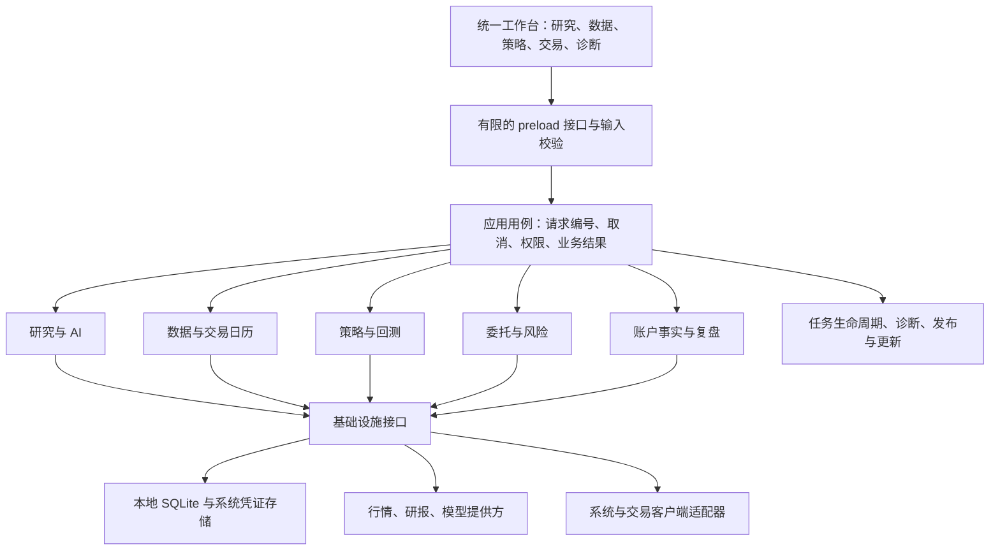

## Context

RT-ResearchFlow 是同一个 Windows / Mac 桌面产品。已确认的 1.0 应用源码为 `41f8429149f646c7dec7f1610082702e7d9cce48`，其后开发分支还有尚未完成交付的更新下载与免费交易日历改动。三个 1.0 安装包已通过各自隔离安装检查；这与真实同花顺、中信账户上的兼容验证是不同证据。

已有源码证据显示：投组主要记录股票与成本，尚不是完整账户账本；回测主要汇总独立信号收益，尚不是资金约束下的组合模拟；部分能力依赖特定数据权限。需要围绕这些真实边界组织产品，避免页面存在就被理解为链路已经跑通。

源码入口和具体耦合点见 `docs/architecture/current-state-audit.md`。竞品对照用于确定能力差距，不据此直接替换核心引擎或复制许可不兼容的实现。

## Goals / Non-Goals

**Goals:**

- 测试者直接描述目标、结果和时间，产品提供可定位的编号与脱敏事实，研发自行复现和回归。
- 每个功能清楚声明依赖、支持范围、可用程度及验证状态。
- 数据、研究、策略、交易各自承担清晰职责，通过稳定契约组合成完整工作流。
- 每次发布具有不可混淆的版本、源码、产物与测试记录。
- 常规实现、修复、隔离检查由团队自主推进，复杂决策集中到主代理。

**Non-Goals:**

- 本轮不进行整仓重写、微服务拆分或数据库整体搬迁。
- 不将隔离测试描述为真实账户交易通过，不改变本人逐笔确认要求。
- 不要求测试者上传密钥、券商凭证、账户资金或持仓明细。
- 不将新设计文档当作所有功能已经完成的证明。

## Decisions

### 1. 保留桌面模块化单体，按使用场景逐步迁移

保留 Electron 与现有服务实现，在调用边界建立用例和适配器。一次迁移一条完整路径，包含页面状态、IPC、主进程服务、错误、测试与诊断。新的实现与旧实现通过明确入口切换，避免复制两套相似业务长期漂移。

界面只提出业务请求并显示状态；preload 不暴露任意通道调用；业务规则不读取 DOM、调用 Electron 或自行建立网络连接；适配器不决定策略与风险规则。现有文件先由边界包装，待测试覆盖充分后再按模块迁移目录。

| 模块 | 负责 | 不负责 | 首要验收 |
| --- | --- | --- | --- |
| 配置与凭证 | 配置版本、局部修改、密钥保存与可用状态 | 页面直接读密钥或数据库 | 只配置一家也能保存，未修改的密钥保持原值 |
| 数据与日历 | 来源、权限、时间、标准字段、数据质量 | 把缺数据解释成零值或正常 | 免费与付费能力分开，休市和陈旧数据可区分 |
| 研究与 AI | 可追溯资料、模型任务、引用与输出结构 | 直接下单、把模型文本作为账户事实 | 输出可回到来源，失败有可执行的处理提示 |
| 策略与回测 | 规则、信号、版本快照、执行与费用假设 | 伪造真实成交或资金账本 | 相同快照可复现，限制在结果旁明确说明 |
| 委托与风险 | 订单意图、检查、本人确认、状态与对账 | 解析不确定时猜测成功或自动补单 | 未知结果停止重发，所有状态可追溯 |
| 账户事实与复盘 | 账户观测、持仓数量、可用量、成交、费用与对账 | 用自选股成本冒充券商持仓 | 观测来源与时间明确，缺失字段保持未知 |
| 运行与交付 | 任务、退出、诊断、备份、升级、版本证据 | 修改业务结论 | 无关功能故障可隔离，退出不访问已关闭数据库 |

选择模块化单体是为了保留现有可用功能并降低部署复杂度。全量重写会同时改变数据格式、业务语义和交付流程，难以确认问题来源；微服务会增加普通桌面用户的安装与运维负担。

### 2. 把“支持什么”和“当前能不能用”分开

每个适配器声明能力，例如股票资料、日线、复权、交易日历、竞价、研报索引、委托查询、撤单。每个请求另外返回运行事实：来源、观测时间、业务时点、时区、覆盖范围、质量状态与已知限制。

能力状态采用 `supported / unsupported / requires-setup`；运行状态采用 `ready / partial / unavailable / unknown`。两者独立，避免“已接入接口”被当作“当前有可用数据”。页面仅根据当前工作流的必要条件判断是否阻断，提示受影响功能及解决动作。

共享契约分别使用 `support` 与 `availability`；`observedAt` 记录本次检查时间，`asOf` 记录数据事实的业务时点，无事实或不适用时为 null。`supported + unavailable` 是合法状态；`unsupported` 或 `requires-setup` 不能同时声称 ready/partial。纯模块先保证这些组合可验证，再由用例负责映射现有供应商结果。

历史日历有明确覆盖年限；超出已发布范围为未知。日线时效按北京时间、最近完成的交易日和数据实际截止时间计算。不同来源的复权口径、证券代码、交易所和延迟必须标准化后才能替换；竞价数据不能由普通报价或日历替代。

### 3. 错误成为稳定业务契约

新增边界使用可区分的成功与失败结果，不让异常字符串成为前端协议。公开错误包含稳定 `code`、非敏感 `message`、安全 `action`、`retryable` 和 `correlationId`；完整异常仅在受控的本地排查路径处理。

错误分类至少覆盖：配置缺失、凭证保存不可用、提供方权限不足、网络失败、数据缺失或过期、输入无效、数据库不可用、客户端能力不支持、交易结果未知、内部故障。不能把所有错误都包装成“重试”；交易提交超时属于结果未知，只允许查询与对账。

用户看到的是“哪个操作失败、是否影响其他功能、下一步做什么”。“正常/提醒/异常”统计和具体工作流阻断要共享同一检查事实及解释，避免一个页面显示零异常、另一区块又无法使用而没有说明。

### 4. 反馈从白名单事实生成，默认留在本地

标准反馈包仅允许：应用版本与构建标识、系统大类与架构、已脱敏的错误编号和有限事件、数据源能力状态、用户填写的非敏感复现步骤、测试结果。使用专用导出数据结构重新构建 JSON，不能把数据库、配置对象或日志目录整体打包后仅靠关键词删敏。

导出前显示预览并由用户选择保存位置。账户、持仓、资金、委托明细、API Key、URL 查询参数、用户名路径与机器标识不在默认白名单内。未知字段不自动传播；嵌套对象、循环引用和超大输入必须有边界。导出只创建本地文件；将内容发送到 GitHub、邮箱或其他平台属于另一项明确动作。

研发根据 `correlationId + buildId + errorCode` 归并问题，补充可复现用例，完成修复后附回归结果。测试者无需理解 SQLite、IPC、原生依赖或整理技术报告。

### 5. 对有副作用的操作建立明确状态与恢复规则

一般后台任务采用 `queued -> running -> succeeded / failed / cancelled`，声明并发策略、超时、取消与重试规则。只读请求允许有限重试，写入和外部操作由各用例决定幂等性。关闭流程停止接收新任务，通知取消，等待正在结束的事务，再关闭数据库和外部资源；超时要留下可诊断状态。

配置更新采用事务与明确的局部更新语义：未提供的密钥表示保持不变，清除必须显式表达。系统凭证加密暂不可用时返回具体错误，不能写入违反数据库约束的空值，也不能悄悄退化为明文。

交易流程采用 `draft -> validated -> awaiting-confirmation -> submitting -> acknowledged / rejected / unknown`；后续成交状态为 `partially-filled / filled / cancelled` 等账户事实。确认绑定账户、证券、方向、数量、价格和有效期的不可变快照；任一关键字段变化都使确认失效。提交意图在副作用前持久化，重复请求不能生成第二笔委托。崩溃发生在提交和回报之间时，重启后先对账；不能因为无回报就重发。撤单成功请求也不等于撤单已完成。

Mac 同花顺适配器必须报告实际可观测能力。无法取得可信账户、委托或成交状态时保留限制和人工核实入口；Windows 不支持的执行路径不能靠同一产品名称推断为支持。AI 输出始终是研究输入，不能直接提升为交易授权。

### 6. 发布是一条可重入的产物交付流程

发布清单绑定内部版本、展示版本、应用源码提交、工作流版本、平台架构、文件大小、SHA-256、签名类型和检查证据。清单中的应用源码与仅发布脚本提交分开记录。Windows x64、Mac arm64、Mac x64 各自安装检查，全部满足对应门槛后公开下载；正式产品版本按 1.0、1.1、1.2 递进。

安装包构建一次，测试与发布复用同一字节内容。发布失败只恢复失败步骤，不重新生成二进制；重试先核对已有标签和产物摘要，不覆盖不同内容。校验清单使用归一化的相对文件名，拒绝目录穿越和重复条目；发布步骤本身也使用带路径前缀、缺失文件、摘要不符的测试样例。

升级保持稳定应用身份并复用安装位置。已有数据路径先明确登记，不能因默认安装到 C 盘而改变；数据库备份使用 SQLite 一致性备份接口或已停止写入的受控方式，不能直接复制仍写入的主库而遗漏 WAL。应用回滚与数据库回滚分别处理，迁移不兼容时不自动降级打开。增量更新待完整安装、数据保留、中断恢复和签名链条验证后引入。

### 6.1 源码盘点后确定的第一批高优先级收敛

盘点已定位三处结构性缺口，运行后果仍需研发在隔离环境复现。它们排在新业务功能扩展之前：

| 问题 | 设计决定 | 必须留下的验收证据 |
| --- | --- | --- |
| 旧调度回调在 stop 后可能重新登记计时器 | SchedulerHost 持有运行代次；start/stop/reschedule 明确改变代次；每个异步回调在 await 前后检查自身所属代次；所有 interval 注册为可释放资源 | 可控 Promise 在 stop/reschedule 后完成，旧代次不会复活或产生第二条调度链 |
| 自动备份在迁移后复制 WAL 主文件 | 复用已有 SQLite backup 能力，初始化拆为打开、升级前快照、迁移、ready；已有库没有可用恢复点时不得悄悄继续危险迁移；新库和已有库分别验收 | 临时旧库含未 checkpoint 提交，备份恢复内容正确；迁移失败可恢复升级前版本 |
| 敏感 IPC 的调用者检查不一致 | 集中调用者与 frame 校验，加请求运行时解码；主窗口与仅诊断的启动故障窗口拥有明确不同能力；拒绝发生在调用业务服务之前 | 非法窗口、子 frame、已销毁页面的服务调用次数为零；合法原有路径保持通过 |

同时保留已有保护：AI 配置保存已有事务与空 Key 兼容修复；手动备份已有一致性 API；数据目录迁移已有 staging、校验与原目录保留；交易已有确认、去重与未知结果保护。重构应复用这些能力，不把历史截图中的错误重新当作当前源码已证实故障。

现有诊断页、健康检查与业务导出入口可用于接入新反馈用例；业务 all 导出仍可能包含持仓成本或研究输入，不能直接改名作为反馈包。新增白名单纯逻辑模块先独立验证，再接入界面和 IPC。

### 7. 模型按风险与复杂度分工，主代理承担交付责任

| 等级 | 执行者 | 任务 | 交付门槛 |
| --- | --- | --- | --- |
| 关键决策 | 当前顶级模型 | 模块边界、资金与订单语义、数据迁移、跨模块变更、复杂缺陷 | 决策理由、契约、失败路径、最终审查 |
| 常规工程 | `gpt-6.1-sol` | 明确范围的模块实现、修复、集成与有意义的测试 | 修改清单、测试证据、限制、可集成结果 |
| 基础执行 | `gpt-6-luna` | 文案、清单、确定性资料整理与低风险机械修改 | 不改变业务语义，Sol 或主代理抽查 |

模型选择同时考虑影响范围、资金与数据副作用、需求歧义和可验证性，不按代码行数决定。Luna 不承担交易规则、数据库迁移、凭证存储、发布授权或风险判断。Sol 遇到跨边界契约冲突、无法解释的失败或两轮修复未收敛时，回交主代理分析；技术不确定性不转嫁给用户。

任务派发必须写明输入、输出、允许修改的文件、验收标准、依赖与完成条件。并行任务写范围不重叠；集成由主代理统一完成。用户已经确认的业务要求、普通修复和测试授权持续有效，不在每个文件或失败步骤重复请示。新增费用、外发敏感数据、不可逆数据处置及未授权的产品方向改变才需要用户作出新的决定。

## Risks / Trade-offs

- 现有代码规模大，包装层可能暂时与旧异常协议并存。以完整使用场景迁移，给旧接口明确适配与退出条件。
- 第三方免费数据源和桌面 UI 会变化。记录能力与客户端指纹，保留失败现场的非敏感事实，不承诺静态兼容永久有效。
- 白名单反馈可能信息不足。优先添加经审查的诊断字段，不能用默认上传全部日志换取便利。
- 账户事实不足会限制对账和组合风控。保持未知并限制依赖此事实的操作，不能用模型推断补齐余额。
- 发布、安装与真实交易验证有不同覆盖范围。证据按场景列示，不以一个总体“通过”掩盖未验证项。

## Migration Plan

1. 完成冻结的 1.0 发布，保留与源码及安装检查的对应关系。
2. 形成现状盘点、目标契约、验收矩阵和模型分工；首个基础模块使用纯逻辑和脱敏样例建立测试。
3. 1.1 优先收敛调度代次、升级前一致性快照和 IPC 检查，再接通标准错误与本地反馈路径；配置保存、已知下载中断问题和日历覆盖提示保留单独回归证据。
4. 再迁移数据能力与调度，保留已有数据和接口；逐条使用场景切换，完成前可退回旧用例入口。
5. 交易、账户账本与风险按同一事实模型集成，再建设资金约束回测与稳健性验证。
6. 每个阶段更新版本和发行说明；已发布安装包不可用同名新文件替换。后续阶段内容按测试反馈排序，不能把所有清单项目预先标记完成。

## Open Questions

当前阶段没有需要用户再次确认的阻塞性产品问题。研发需通过源码和隔离验证解决：现有诊断导出的覆盖范围、主进程退出顺序、各数据适配器真实能力、配置迁移兼容性。真实交易客户端的可观测能力由账户本人在其设备上的去敏结果补充，不要求账户凭证。
